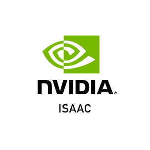
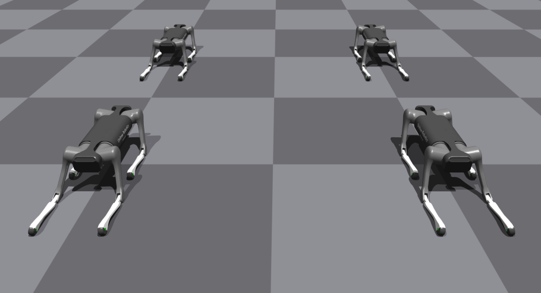
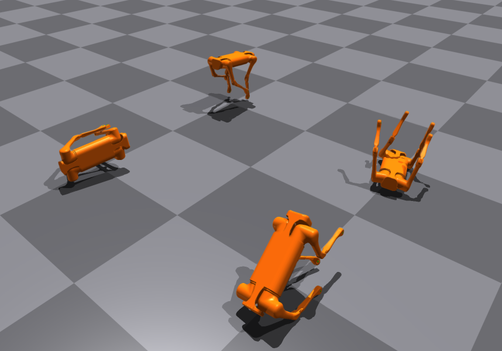

# RL MPC Locomotion



## Control Blocks


## Development Log
- python模仿结构体必须放在__init__()里面，否则无法实例化
- class可以声明确定类型的值为None成员变量
- `*` 对mat做矩阵乘法, 对ndarray做点乘 
- `@` 矩阵乘法
- `.dot` 矩阵乘法 
- `np.mutiply` 点乘
- `self._quadruped:Quadruped = None` 类内类型声明
- Successfully bridge Isaac Gym and MPC Controller on 1.7.2022, it took me 1 month coding blindly.

### Architecture
```c
main() ->
    Quadruped,
    RobotRunner ->
        LegController,
        DesiredStateCommand,
        StateEstimatorContainer,
        MIT_UserParameters,
        MIT_Controller ->
            ControlFSM ->
                FSM_State_Locomotion ->
                    ConvexMPCLocomotion ->
                        convexMPC_interface ->
                            SolverMPC
```

### Partially implemented:
- SimulationBridge
- RobotRunner
- StateEstimatorContainer
- LegController
- ControlFSM
- FSM_State_Locomotion

### Fully implemented:
- ConvexMPCLocomotion
- convexMPC_interface
- SolverMPC

## User Notes

- [Import URDF model in ISAAC](docs/0-model_import.md)
- [Install MIT Cheetah Software](docs/1-MIT_cheetah_installation.md)

## Gallery



