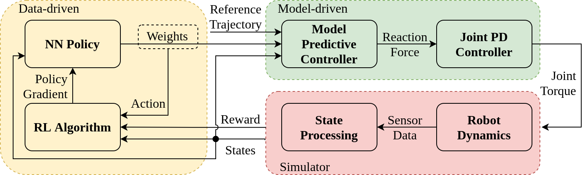
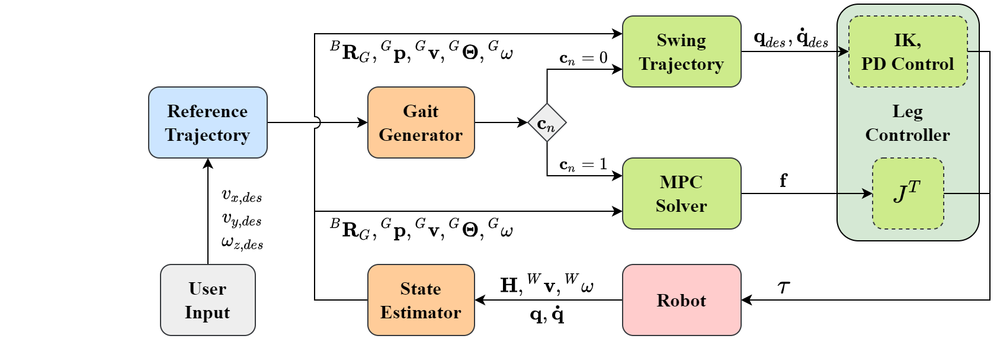
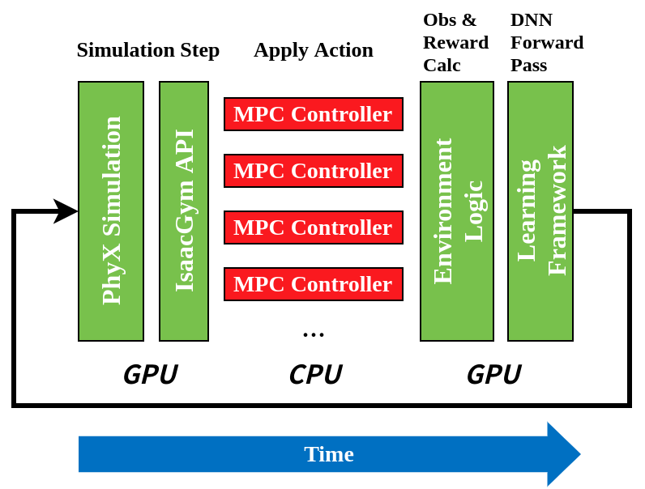
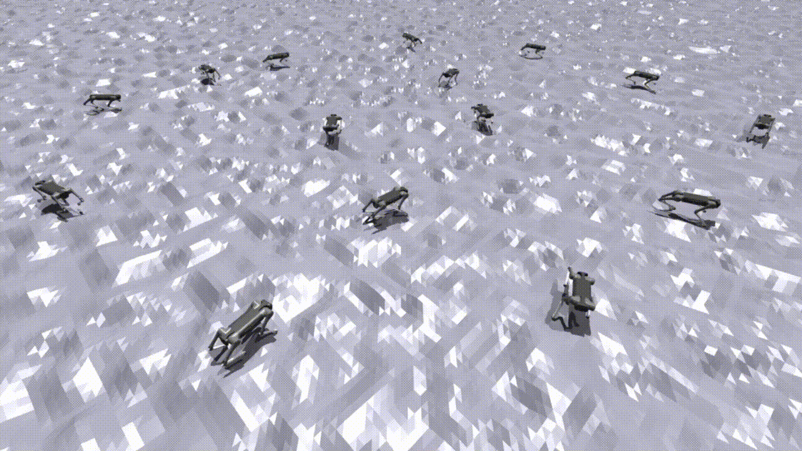
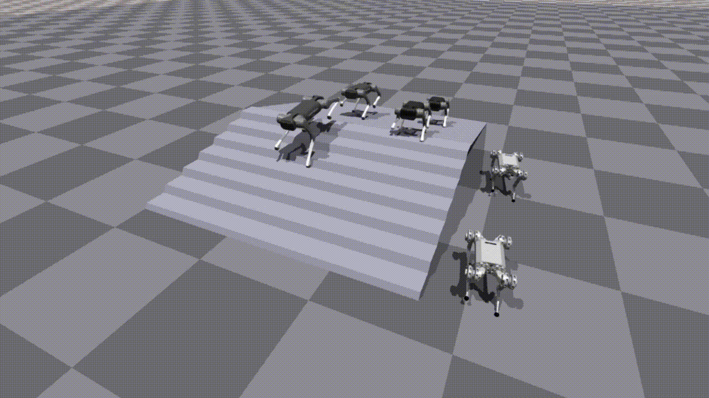

# RL MPC Locomotion
This repo is aim to provide a fast simulation and RL training platform for quadrupad locomotion. The control framework is a hierarchical controller  composed of an higher-level policy network and a lower-level model predictive controller (MPC). 

The MPC controller refers to [Cheetah Software](https://github.com/mit-biomimetics/Cheetah-Software) but written in python, and it completely opens the interface between sensor data and motor commands, so that the controller can be easily ported to mainstream simulators like MuJoCo.

The RL training is carried out in the [NVDIA Isaac Gym](https://developer.nvidia.com/isaac-gym) in parallel using Unitree Robotics Aliengo model, and transferring it from simulation to reality on a [real Aliengo robot](#sim2real_anchor).


## Frameworks



## Dependencies
- [*PyTorch* - 1.8.1](https://pytorch.org/get-started/previous-versions/)
- [*Isaac Gym* - Preview 4](https://developer.nvidia.com/isaac-gym)
- [*RL Games* - 1.5.2](https://github.com/Denys88/rl_games)
<!-- - *OSQP* - 0.6.2 -->

## Installation

1. Clone this repository
    ```bash
    git clone git@github.com:silvery107/rl-mpc-locomotion.git
    git submodule update --init
    ```
    Or use `--recurse` option to clone submodules at the same time.

3. Create the conda environment:
    ```bash
    conda env create -f environment.yml
    ```

2. Install the python binding of the MPC solver:
    ```bash
    pip install -e .
    ```

## Quick Start
1. Play the MPC controller on Aliengo:
    ```bash
    python RL_MPC_Locomotion.py --robot=Aliengo
    ```
    All supported robot types are `Aliengo`, `A1` and `Mini_Cheetah`.
    Note that by default you need to plug in your Xbox-like gamepad to control it.

    - Gamepad keymap
        > Press `LB` to switch gait types between `Trot`, `Fly Tort`, `Gallop`, `Walk` and `Pace`.

        > Press `RB` to switch FSM states between `Locomotion` and `Recovery Stand`

2. Train a new policy:
    Set `bridge_MPC_to_RL` to `True` in `<MPC_Controller/Parameters.py>`
    ```bash
    cd RL_Environment
    python train.py task=Aliengo headless=False
    ```
    Press the `v` key to disable viewer updates, and press again to resume. 
    Set `headless=True` to train without rendering.

    Tensorboard support is avaliable, run `tensorboard --logdir runs`.

3. Load a trained checkpoint:
    ```bash
    python train.py task=Aliengo checkpoint=runs/Aliengo/nn/Aliengo.pth test=True num_envs=4
    ```
    Set `test=False` to continue training.

4. Run the trained weight-policy for MPC controller on Aliengo:
    ```bash
    python RL_MPC_Locomotion.py --robot=Aliengo --mode=Policy
    ```
    By default the controller mode is `Fsm`, and you can also try `Min` for the minimum MPC controller (without FSM).

## Roadmaps



- [x] **MPC Controller**
- [Quadruped](MPC_Controller/common/Quadruped.py),
- [RobotRunner](MPC_Controller/robot_runner/RobotRunnerFSM.py) ->
    - [LegController](MPC_Controller/common/LegController.py),
    - [StateEstimator](MPC_Controller/StateEstimator.py),
    - [ControlFSM](MPC_Controller/FSM_states/ControlFSM.py) ->
        - [FSM State RecoveryStand](MPC_Controller/FSM_states/FSM_State_RecoveryStand.py),
        - [FSM State Locomotion](MPC_Controller/FSM_states/FSM_State_Locomotion.py) ->
            - [ConvexMPCLocomotion](MPC_Controller/convex_MPC/ConvexMPCLocomotion.py) ->
                - [FootSwingTrajectory](MPC_Controller/common/FootSwingTrajectory.py),
                - [Gait](MPC_Controller/convex_MPC/Gait.py),
                - [MPC Solver in C](MPC_Controller/convex_MPC/mpc_osqp.cc)



- [x] **RL Environment**
- [Gamepad Reader](RL_Environment/gamepad_reader.py),
- [Simulation Utils](RL_Environment/sim_utils.py),
- [Weight Policy](RL_Environment/WeightPolicy.py),
- [Train](RL_Environment/train.py) ->
    - [Vectorized Env](RL_Environment/tasks/base/vec_task.py),
    - [Aliengo Env](RL_Environment/tasks/aliengo.py)

## User Notes

- [Setup a Simulation in Isaac Gym](docs/3-isaac_api_note.md)
- [Install MIT Cheetah Software](docs/1-MIT_cheetah_installation.md)
- [Upgrade Isaac Gym Preview 2 to Preview 3](docs/5-upgrade_isaac_gym.md)
- [OSQP, qpOASES and CVXOPT Solver Instructions](docs/6-qp_solver.md)
- [Development Logs](docs/2-development_log.md)

## Gallery





<a name="sim2real_anchor"></a>
