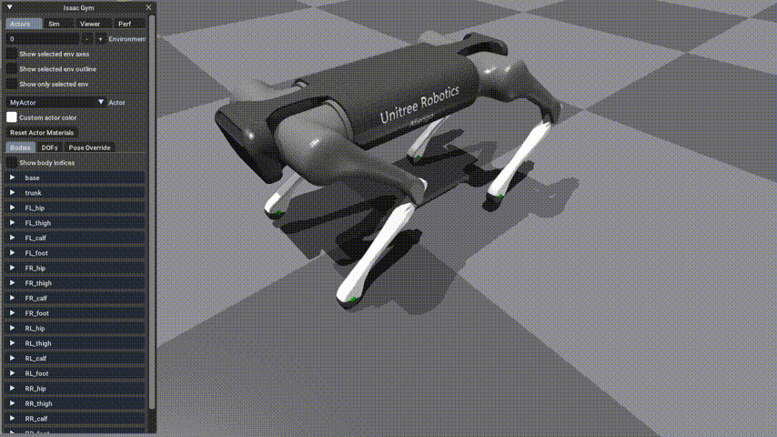

# RL MPC Locomotion

## Control Blocks

## Development Log

  
Dec 3, 2019 -- Jan 7, 2022

  <ul>
  <li>python模仿结构体必须放在__init__()里面, 否则无法实例化
  <li>class可以声明确定类型的值为None成员变量
  <li>`*` 对mat做矩阵乘法, 对ndarray做点乘 
  <li>`@` 矩阵乘法
  <li>`ndarray.dot` 矩阵乘法 
  <li>`np.mutiply()` 点乘
  <li>`self._quadruped:Quadruped = None` 类内类型声明
  <li>Successfully bridge Isaac Gym and MPC Controller on 1.7.2022, it took me 1 month coding blindly.
  <li>矩阵和列表的等号赋值是不安全的
  </ul>

  
Jan 8, 2022 -- Jan 18, 2022

  <ul>
  <li>solver exp存在指数爆炸 1.8
  <li>`np.copyto()` numpy ndarray copy
  <li>`copy.copy()` for shallow copy
  <li>`copied_list[:] = original_list` shallow copy for list with out a new `id`
  <li>`scipy.linalg.expm` Compute the matrix exponential using Pade approximation.
  <li>目前CPU跑满了,可能还有不少优化空间 1.9
  <li>控制器无延时死循环导致cpu跑满 1.11
  <li>在ISAAC中控制器频率受到仿真器限制(软实时), 500Hz只消耗20%CPU 1.12
  <li>改写了legController Commands的更新, 全部换成`np.copyto`
  <li>`ndarray.item()`
  <li>腿部控制器需要按照`SpineBoard.cpp`改写`legController.command`到12自由度的torque
  <li>bridged legController, stateEstimator and simulator 1.13
  <li>关节零点待修正, 控制器基本work 1.14
  <li>10 horizon MPC average solved time: 0.1 s
  <li>MPC solver needed to be check, like result order etc... 1.17
  <li>joint zero pos and conventions !!! 摆动相和站立相永远差一个pi..... 1.18
  </ul>

  
Feb 4, 2022 -- Feb 9, 2022

  <ul>
  <li>优化了调试参数传递方式, 目前打算重新检查一遍翻译是否有误, 以及用 C++ 编译求解器提高效率 2.4
  <li>`<convex_MPC>`, `<common>`, `<FSM_states>` folders double checked 
  <li>经过调整左右腿符号和偏置顺序, 给0初始速度, 摆动相正常、雅克比正常, 支撑相异常、反向 2.5
  <li>以及mini cheetah 模型腿部惯量有问题、不均匀
  <li>work 了???!!! 2.5 [video](images/MPC_trot_first.mkv)
  <li>TODO 用 PyBind11 转译一下solver, 或者测试一下OSQP
  <li>OSQP 求解10ms 总时间12-15ms 大惊喜
  <li>Isaac Gym 升级到 preview 3 2.6
  <li>仿真步长太长0.01行走有抖动, 不稳定, 太短0.001则很卡, gym渲染时间太长0.04 2.7
  <li>用CPP重写solver 用pybind11转译 用osqp eigen求解 平均用时1ms 但加上数据转换时间后长达30ms 2.9
  </ul>

  
Feb 16, 2022 -- Feb 20, 2022

  <ul>
  <li>在谷歌motion imitation中完整剥离了MPC控制器,效果不错,但是是基于pybullet的仿真.重新编译基于c的控制器也很成功 2.16
  <li>目前谷歌最新的mpc 是 fast and efficient, 编译成功, 但是cc文件做了多线程加速, 需要用自带的 setup.py 编译 2.19
  <li>fast and efficient `cc` 文件编译运行失败的原因应该是 third_party 库和 usr/local/lib 中的版本不一致
  <li>TODO 先不纠结编译问题，用setup编译的so跑移植，测试单独solver移植可行性
  <li>单独移植yuxiang solver成功，求解总时间0.001 但是mpc仍然有腿软的问题，怀疑是apply force isaac有误 2.19
  <li>mini cheetah trot 完全成功，多机器人mpc成功，抗扰动鲁棒性也不错，调整了body mass 和 inertia 来稳定控制器，目前是100Hz 2.20
  <li>aliengo 似乎朝向错了
  <li>增加了a1支持, 但是 aliengo和 a1 都在往地上走, 很奇怪 2.20
  </ul>

  
Feb 26, 2022 -- Mar 7, 2022

  <ul>
  <li>TODO 对比两组 a1 的控制器输入输出来找bug 2.26 (已完成)
  <li>debug 完成, aliengo 和 a1 都可以走了, bug 在于宇树 hip、knee 电机正方向和 mit 相反且为 revolute 关节, 对应反向并改为 continuous 关节即可 2.27
  <li>TODO 写个机器人初始化姿态控制即可, 然后把手柄控制器加上 2.27 (已完成)
  <li>手柄控制完成, 增加了 pronk, bound, pace 步态和对应的手柄按键逻辑 2.28
  <li>recovery stand 和 passive FSM 写好了, 还需要 debug 一下 2.28
  <li>TODO 调通 FSM 后把transition data 换成 done (已完成)
  <li>mpc stand 有问题, locomotion transition 有问题
  <li>Recovery stand 调试完成 3.1
  <li>locomotion transition 到 recovery 的时候自动转移和手动转移冲突了 3.1
  <li>TODO mpc stand 需要更换参考轨迹 (弃用)
  <li>TODO 还差一个地面法向量估计算法 (已完成)
  <li>全局自动转移通过虚拟按键解决 3.2
  <li>RL train 的时候个体自动转移: 加一个私有域存当前的control mode, 或者在 locomotion unsafe 的时候直接 reset, 固定gait type
  <li>摔倒以后会乱跑了, com 状态给错了, 给的是 world 状态, 指令全成了朝仿真器坐标朝向 3.2
  <li>TODO 触地检测 用力传感器做, 配合状态变换完成地面法向量估计 (已完成)
  <li>调节渲染间隔 把力控提到 1k Hz 3.3
  <li>加了力传感器, 身体系和世界系没有对齐的时候就会乱跑, 趋于一个对齐的参考轨迹, 坐标变换有问题 3.3
  <li>MPC stand 要配合WBC的task才有用 决定放弃 stand 步态 3.4
  <li>坐标变换修好了, 把所有世界系的指令换成身体系了 3.5
  <li>地面法向量估计写好了 3.5
  <li>TODO 设计 RL 算法: step, update, reset, action ... observation, rewards ...
  <li>已完成 uneven terrain 搭建, 目前身体高度估计错误, 同时状态没有变换到和地面法向量对齐的坐标系 3.5
  <li>修正了坐标变换和身体高度估计, 但是法向量估计有问题, 长时间在斜坡踏步会导致估计反向 3.6
  <li>修正了位置估计bug, 实现上下斜坡、台阶 3.7
  </ul>

### Roadmap
- [Quadruped](MPC_Controller/common/Quadruped.py),
- [RobotRunner](MPC_Controller/RobotRunner.py) ->
    - [LegController](MPC_Controller/common/LegController.py),
    - [StateEstimatorContainer](MPC_Controller/state_estimate/StateEstimatorContainer.py),
    - [ControlFSM](MPC_Controller/FSM_states/ControlFSM.py) ->
        - [FSM_State_RecoveryStand](MPC_Controller/FSM_states/FSM_State_RecoveryStand.py)
        - [FSM_State_Locomotion](MPC_Controller/FSM_states/FSM_State_Locomotion.py) ->
            - [ConvexMPCLocomotion](MPC_Controller/convex_MPC/ConvexMPCLocomotion.py) ->
                - [FootSwingTrajectory](MPC_Controller/common/FootSwingTrajectory.py),
                - [Gait](MPC_Controller/convex_MPC/Gait.py)
                - [SolverMPC in C](MPC_Controller/convex_MPC/mpc_osqp.cc)

- [Gamepad Reader](RL_Simulator/gamepad_reader.py)

## User Notes

- [Import URDF model in ISAAC](docs/0-model_import.md)
- [Install MIT Cheetah Software](docs/1-MIT_cheetah_installation.md)
- [Development Log: Cheetah Software in Python](docs/2-development_log.md)
  - [How to imitate a C/C++ STRUCT in Python?](docs/2-development_log.md#how-to-imitate-a-cc-struct-in-python)
  - [How to copy data from list or ndarray into a Python struct?](docs/2-development_log.md#how-to-copy-data-from-list-or-ndarray-into-a-python-struct)
  - [Matrix multiplication and exponential](docs/2-development_log.md#matrix-multiplication-and-exponential)
  - [Quadratic programming with CVXOPT](docs/2-development_log.md#quadratic-programming-with-cvxopt)
- [Upgrade IsaacGym Preview 2 to Preview 3](docs/3-isaac_api_note.md)
- [QP Solver Installation and Testing](docs/6-qp_solver.md)

## Gallery

