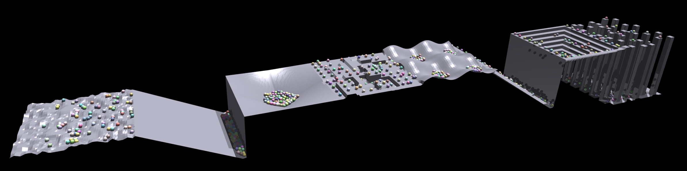

# Isaac API Notes

## Simulation Setup
The API is procedural and **data-oriented** rather than object-oriented. This makes it easy to work with the data using common Python libraries like NumPy, which provides efficient methods to manipulate multidimensional arrays. It is also possible to access the simulation data as CPU or GPU tensors that can be shared with common deep learning frameworks like PyTorch.
### Simulation Configuration
1. Initialize gym
    ```py
    from isaacgym import gymapi
    gym = gymapi.acquire_gym()
    ```
2. Get default set of parameters
    ```py
    sim_params = gymapi.SimParams()
    ```
3. Set common parameters
    ```py
    sim_params.dt = dt # control timestep
    sim_params.substeps = 2 # physics simulation timestep
    sim_params.up_axis = gymapi.UP_AXIS_Z
    sim_params.gravity = gymapi.Vec3(0.0, 0.0, -9.81)
    ```
4. Set PhysX parameters
    ```py
    sim_params.physx.use_gpu = True
    sim_params.physx.solver_type = 1 # TGS
    sim_params.physx.num_position_iterations = 4 # improve solver convergence
    sim_params.physx.num_velocity_iterations = 1 # keep default

    # shapes whose distance is less than the sum of their contactOffset values will generate contacts
    sim_params.physx.contact_offset = 0.02

    # two shapes will come to rest at a distance equal to the sum of their restOffset values
    sim_params.physx.rest_offset = 0.0

    # A contact with a relative velocity below this will not bounce.
    sim_params.physx.bounce_threshold_velocity = 0.2

    # The maximum velocity permitted to be introduced by the solver to correct for penetrations in contacts.
    sim_params.physx.max_depenetration_velocity = 100.0
    ```
5. Creating a simulation
    ```py
    sim = gym.create_sim(compute_device=0, graphics_device=0, 
            type=gymapi.SIM_PHYSX, params=sim_params)
    ```

### Robots Models
Gym currently supports loading models in URDF, MJCF, and USD file formats.

1. Configure asset options
    ```py
    asset_options = gymapi.AssetOptions()
    asset_options.fix_base_link = False
    asset_options.use_mesh_materials = True
    asset_options.flip_visual_attachments = False # switch mesh coordinates
    asset_options.armature = 0.01 # value added to the diagonal elements of inertia. Could improve simulation stability
    ```
2. Loading assets
    ```py
    asset_root = "assets"
    asset_file = "robot_description/model.urdf"
    asset = gym.load_asset(sim, asset_root, asset_file, asset_options)
    ```
### Environments and Actors
1. Set up the environment grid
    ```py
    # set up the env grid
    num_envs = 64
    envs_per_row = 8
    env_spacing = 2.0
    env_lower = gymapi.Vec3(-env_spacing, 0.0, -env_spacing)
    env_upper = gymapi.Vec3(env_spacing, env_spacing, env_spacing)
    ```
1. Create and populate environments and actors
    ```py
    # cache some common handles for later use
    envs = []
    actors = []

    # create and populate the environments
    for i in range(num_envs):
        env = gym.create_env(sim, env_lower, env_upper, envs_per_row)
        envs.append(env)

        pose = gymapi.Transform()
        pose.p = gymapi.Vec3(0.0, 0.0, height)

        actor_handle = gym.create_actor(env, asset, pose,
                        "MyActor", group=i, filter=1)
        actors.append(actor_handle)
    ```

    Note in `gym.create_actor`:
    
    > **collision_group:**  Two bodies will only collide with each other if they belong to the same collision group.
    
    >**collision_filter:**  Two bodies will not collide if their collision filters have a common bit set.

### Running the Simulation
1. Add a viewer
    ```py
    viewer = gym.create_viewer(sim, gymapi.CameraProperties
    cam_pos = gymapi.Vec3(1, 1, 1)
    cam_target = gymapi.Vec3(0, 0, 0)
    gym.viewer_camera_look_at(viewer, env, cam_pos, cam_target)
    ```

2. Set up a basic simulation loop
    ```py
    while not gym.query_viewer_has_closed(viewer):
        # step the physics
        gym.simulate(sim)
        gym.fetch_results(sim, True)

        # run controller

        # update the viewer
        gym.step_graphics(sim);
        gym.draw_viewer(viewer, sim, True)

        # Wait for dt to elapse in real time
        gym.sync_frame_time(sim)

    # release viewer and sim objects
    gym.destroy_viewer(viewer)
    gym.destroy_sim(sim)
    ```
## Joint Torque Control
- Configure joint properties
    ```py
    props = gym.get_actor_dof_properties(env, actor)
    # DOF_MODE_EFFORT, DOF_MODE_POS, DOF_MODE_VEL
    props["driveMode"].fill(gymapi.DOF_MODE_EFFORT)
    # stiffness and damping are used for joint PD control
    props["stiffness"].fill(0.0)
    props["damping"].fill(0.0)
    gym.set_actor_dof_properties(env, actor, props)
    ```

- Retrieve joint states
    ```py
    dof_states = gym.get_actor_dof_states(env, actor, gymapi.STATE_ALL)
    dof_states["pos"]   # all positions in meters/radians
    dof_states["vel"]   # all velocities in meters/radians per second
    ```

- Apply joint torque control
    ```py
    # efforts must be applied every frame
    gym.apply_actor_dof_efforts(env, actor, efforts)
    ```

## Rigid Body States

- Get rigid body states of the robot body
    ```py
    body_idx = gym.find_actor_rigid_body_index(env, actor, body_name, gymapi.DOMAIN_ACTOR)
    body_states = gym.get_actor_rigid_body_states(env, actor, gymapi.STATE_ALL)[body_idx]
    ```

- Access rigid body states
    ```py
    body_states["pose"]["p"] # positions (Vec3: x, y, z)
    body_states["pose"]["r"] # orientations (Quat: x, y, z, w)
    body_states["vel"]["linear"] # linear velocities (Vec3: x, y, z)
    body_states["vel"]["angular"] # angular velocities (Vec3: x, y, z)
    ```

## Force Sensors
### Rigid Body Force Sensors
Force sensors are created on assets. This way, you only need to define the force sensors once and they will be created on every actor instanced from the asset.
1. Create rigid body force sensors
    ```py
    body_idx = gym.find_asset_rigid_body_index(asset, "bodyName")

    sensor_pose = gymapi.Transform(gymapi.Vec3(0.0, 0.0, 0.0))

    sensor_props = gymapi.ForceSensorProperties()
    sensor_props.enable_forward_dynamics_forces = True
    sensor_props.enable_constraint_solver_forces = True
    sensor_props.use_world_frame = False

    gym.create_asset_force_sensor(asset, body_idx, sensor_pose, sensor_props)
    ```
2. Cache the force sensor handles
    ```py
    sensors = []
    for env, actor_handle in zip(envs, actors):
        num_sensors = gym.get_actor_force_sensor_count(env, actor_handle)
        for i in range(num_sensors):
            sensor = gym.get_actor_force_sensor(env, actor_handle, i)
            sensors.append(sensor)
    ```
3. Query sensor readings
    ```py
    sensor_data = sensors[0].get_forces()
    print(sensor_data.force)   # force as Vec3
    print(sensor_data.torque)  # torque as Vec3
    ```
### Joint Force Sensors
1. Enable reading forces on each degree-of-freedom of articulated actors
    ```py
    gym.enable_actor_dof_force_sensors(env, actor_handle)
    ```
2. Retrieve force data
    ```py
    forces = gym.get_actor_dof_forces(env, actor_handle)
    ```

## Terrains
### Ground Plane
1. Configure the ground plane
    ```py
    plane_params = gymapi.PlaneParams()
    plane_params.normal = gymapi.Vec3(0, 0, 1) # z-up!
    plane_params.static_friction = 1
    plane_params.dynamic_friction = 1
    plane_params.restitution = 0 # elasticity of collisions
    ```

1. Create the ground plane
    ```py
    gym.add_ground(sim, plane_params)
    ```

### Uneven Terrains
Supported terrains types are Random Uniform Terrain, Sloped Terrain, Pyramid Sloped Terrain, Discrete Obstacles Terrain, Wave Terrain, Stairs Terrain, Pyramid Stairs Terrain, Stepping Stones Terrain.


1. Configure uneven terrains
    ```py
    num_terains = 8
    terrain_width = 12.
    terrain_length = 12.
    horizontal_scale = 0.25  # [m]
    vertical_scale = 0.005  # [m]
    num_rows = int(terrain_width/horizontal_scale)
    num_cols = int(terrain_length/horizontal_scale)
    heightfield = np.zeros((num_terains*num_rows, num_cols), dtype=np.int16)

    def new_sub_terrain(): return SubTerrain(width=num_rows, length=num_cols, vertical_scale=vertical_scale, horizontal_scale=horizontal_scale)
    ```
2. Create all available terrain types
    ```py
    heightfield[0*num_rows:1*num_rows, :] = random_uniform_terrain(new_sub_terrain(), min_height=-0.2, max_height=0.2, step=0.2, downsampled_scale=0.5).height_field_raw
    heightfield[1*num_rows:2*num_rows, :] = sloped_terrain(new_sub_terrain(), slope=-0.5).height_field_raw
    heightfield[2*num_rows:3*num_rows, :] = pyramid_sloped_terrain(new_sub_terrain(), slope=-0.5).height_field_raw
    heightfield[3*num_rows:4*num_rows, :] = discrete_obstacles_terrain(new_sub_terrain(), max_height=0.5, min_size=1., max_size=5., num_rects=20).height_field_raw
    heightfield[4*num_rows:5*num_rows, :] = wave_terrain(new_sub_terrain(), num_waves=2., amplitude=1.).height_field_raw
    heightfield[5*num_rows:6*num_rows, :] = stairs_terrain(new_sub_terrain(), step_width=0.75, step_height=-0.5).height_field_raw
    heightfield[6*num_rows:7*num_rows, :] = pyramid_stairs_terrain(new_sub_terrain(), step_width=0.75, step_height=-0.5).height_field_raw
    heightfield[7*num_rows:8*num_rows, :] = stepping_stones_terrain(new_sub_terrain(), stone_size=1.,
                                                                    stone_distance=1., max_height=0.5, platform_size=0.).height_field_raw
    ```
3. Add the terrain as a triangle mesh
    ```py
    vertices, triangles = convert_heightfield_to_trimesh(heightfield, horizontal_scale=horizontal_scale, vertical_scale=vertical_scale, slope_threshold=1.5)
    tm_params = gymapi.TriangleMeshParams()
    tm_params.nb_vertices = vertices.shape[0]
    tm_params.nb_triangles = triangles.shape[0]
    tm_params.transform.p.x = -1.
    tm_params.transform.p.y = -1.
    gym.add_triangle_mesh(sim, vertices.flatten(), triangles.flatten(), tm_params)
    ```
