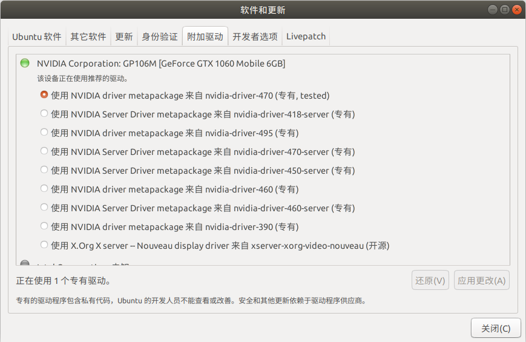

# Upgrade IsaacGym Preview 2 to Preview 3

## Install NVIDIA driver 470 or above
Install Nvidia drivers on Ubuntu 18.04 using GNOME GUI or Command Line methods.

1. GNOME GUI:

     
    
    Open the Software & Updates application window. Select TAB Additional Drivers and choose any proprietary NVIDIA driver. The higher the driver number the latest the version.

1. Command Line:

    ```bash
    # detect the model of nvidia GPU and the feasible drivers
    ubuntu-drivers devices  
    # install desired driver or recommanded driver selectively
    sudo apt install nvidia-driver-470
    # Once the installation is concluded, reboot it
    sudo reboot
    ```

## Remove IsaacGym Preview 2

```bash
conda remove --name rlgpu --all
```

## Install IsaacGym Preview 3

1. Change env name to `rlmpc` in both `create_conda_env_rlgpu.sh` and `rlgpu_conda_env.yml`

    ```bash
    ./create_conda_env_rlgpu.sh
    conda activate rlmpc
    ```

    To test IsaacGym is installed, use `python joint_monkey.py` in `<python/example>` folder.

1. After install Isaac Gym, check and install [Isaac Gym Benchmark Environments](https://github.com/NVIDIA-Omniverse/IsaacGymEnvs/blob/main/README.md).

    ```bash
    git clone https://github.com/NVIDIA-Omniverse/IsaacGymEnvs.git
    cd IsaacGymEnvs
    pip install -e .
    ```

    To test IsaacGymEnvs is installed, use `python train.py task=Cartpole` in `<isaacgymenvs>` folder.

## Install MPC solver dependencies
```bash
conda install -c conda-forge osqp # OSQP
conda install -c conda-forge cvxopt # CVXOPT
conda install -c mosek mosek # MOSEK
```

For detials, please check [environment.yml](../environment.yml).


